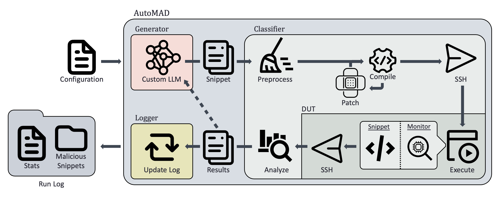

*Explore My Research:*

|&nbsp;&nbsp;&nbsp;[About Me](#about-me)&nbsp;&nbsp;&nbsp;|&nbsp;&nbsp;&nbsp;[Skills & Expertise](#skills--expertise)&nbsp;&nbsp;&nbsp;|&nbsp;&nbsp;&nbsp;[Projects](#projects)&nbsp;&nbsp;&nbsp;|&nbsp;&nbsp;&nbsp;[Contact](#contact)&nbsp;&nbsp;&nbsp;|

<figure>
    
</figure>

# About Me

I’m a senior Computer Engineering major in the Honors Program at the University of New Hampshire (UNH), maintaining a 3.97 GPA while conducting cutting-edge research in system security at the Resilient Architecture Lab. Over the past two years, I’ve led projects focused on microarchitectural security. This involved designing experiments, analyzing data, and presenting findings at academic conferences.

Beyond research, I love tinkering with hardware: building computers, working with embedded systems, and programming FPGAs. I’m also passionate about machine learning, with coursework in Reinforcement Learning and Natural Language Processing, and hands-on PyTorch experience.

# Skills & Expertise

## Technical Skills:

**Languages:** C, Python, MATLAB, Java, Assembly, Bash, Verilog

**Systems:** Embedded Systems, FPGAs, VLSI, Computer Architecture

**Tools:** Git, Linux, macOS, Windows

**Machine Learning:** PyTorch, Reinforcement Learning, Natural Language Processing

## Research Skills:

**Data Analysis & Visualization:** SciPy, MatPlotLib, Pandas, Numpy

**Academic Paper Review & Technical Documentation:** ?

**Conference Presentations & Public Speaking:** Presented at URC 2024, URC 2025, and WISE 2024

# Projects

I've been working on the following projects during my time as a research assistant. Stay tuned for updates, and hopefully a link to an accepted conference paper.

## AutoMAD: Leveraging Large Language Models for Automated Microarchitectural Attack Discovery

<figure>
    
    <figcaption>Figure 1: AutoMAD Block Diagram</figcaption>
</figure>

### Description
- **Task:** Create an open-source, automatic tool for discovering vulnerabilities in microarchitecture
- **Action:** Used the Hugging Face API to train a custom Large Language Model, implemented a novel processing algorithm, designed an easy to use front end
- **Results:** Found code snippets that were capable of producing rapid power oscillations, necessary code for a fault injection attack, proving AutoMAD is a promising framework for discovering attacks

For a closer look at the project, visit the [repo](https://github.com/skylar-gagnon/automad)!

## F4kEOUT

This project is still a work in progress, so stay tuned for updated!

- **Focus:** Reverse engineering the address resolution mechanics in the store buffer which causes the 4k aliasing effect on 11th+ generation Intel processors

# Contact
|&nbsp;&nbsp;&nbsp;[LinkedIn](https://www.linkedin.com/in/skylar-gagnon-152a302a8/)&nbsp;&nbsp;&nbsp;|&nbsp;&nbsp;&nbsp;[GitHub](https://github.com/skylar-gagnon)&nbsp;&nbsp;&nbsp;|&nbsp;&nbsp;&nbsp;[Email](mailto:skylar.gagnon02@gmail.com)&nbsp;&nbsp;&nbsp;|